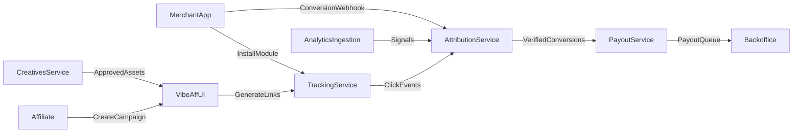

# VibeAff Architecture

## Core Components
- Tracking Service: link generation, click tracking, device fingerprinting.
- Attribution Service: conversion matching, deduplication, window logic.
- Payout Service: commission calculation, holds, disbursements.
- Creatives Service: variant generation, storage, approvals.
- Analytics Ingestion: GA and ads library data import.
- Admin/Backoffice UI: monitoring, approvals, risk review.

## Data Flow

## One-Command Integration Module
- Client SDK: captures attribution parameters and click IDs.
- Server webhook: receives signed conversion events.
- Auto-detect framework and inject middleware (Node, Python, PHP).
- Configuration via env vars and single install command.

## Storage and Security
- Event store for clicks and conversions.
- Encrypted secrets storage for integrations and payouts.
- Audit logs for program changes and payout actions.

## Scaling
- Partitioned event storage by merchant.
- Async processing for attribution and payout jobs.
- Horizontal scaling for tracking and webhook ingest.
